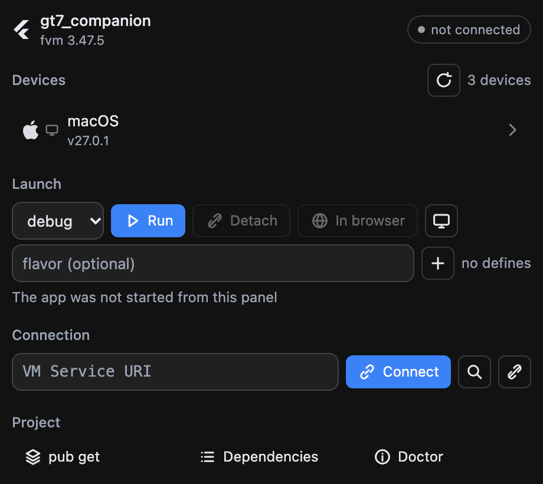
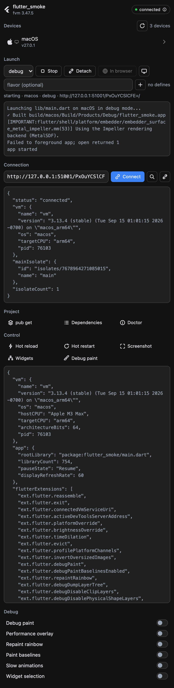

# dsh-flutter-panel

A Flutter panel for the [DeepSeek Harness](https://github.com/deepseek-ai) sidebar: run, inspect and
profile a Flutter app without leaving the conversation.



Devices come from a long-lived `flutter daemon`, launching is `flutter run --machine` with the VM
Service URI picked up automatically, and everything else goes through the running app's own VM
Service and [`flutter-devtools-mcp`](https://www.npmjs.com/package/flutter-devtools-mcp).



## Features

- **Devices** — a long-lived `flutter daemon` (events, not polling): a phone plugged in appears by
  itself. The section shows one selected device with its OS logo (Apple, Android, Windows, Linux, or
  a browser for web targets) plus a small kind icon; clicking opens the list to switch, and the
  choice is remembered per project. Emulators come from the same daemon.
- **Launch** — device, mode (debug / profile / release), flavor and `--dart-define` pairs, then one
  button that runs or stops depending on the state. The panel reads `app.debugPort` and connects
  itself; app logs land in the panel.
- **Flavor and defines** — flavors are suggested from the project (Android `productFlavors`,
  non-default Xcode schemes); defines are a key/value editor. Both are remembered per project and
  validated before they reach the command line.
- **Control** — hot reload, hot restart, screenshot (inline), widget tree, debug paint.
- **Debug toggles** — the service extensions the app actually registered: `debugPaint`,
  `showPerformanceOverlay`, `repaintRainbow`, `debugPaintBaselinesEnabled`, `timeDilation`,
  `inspector.show`.
- **DevTools inside the panel** — the daemon hosts the DevTools server and the panel embeds it
  (inspector, performance, cpu-profiler, memory, network, logging), with a button to move the same
  page into a sidebar browser tab.
- **App facts and memory** — VM version, platform, pid and isolates as a key/value block; live heap
  readout, a GC button, saved memory snapshots and a compare of the last two.
- **Captures and profiling** — rebuild tracking and HTTP capture as single switches, profiling
  session, `collect_performance_session` with the workspace root filled in.
- **Project commands** — `pub get`, `pub outdated`, `flutter doctor` with rendered output:
  `pub outdated` becomes a table with the upgradable rows highlighted, `flutter doctor` a checklist.
- **Detach and web** — leave the app running while the panel stops tracking it, or open a web build
  in a sidebar browser tab.
- **SDK** — the workspace's own pin (`.fvm/flutter_sdk`, then `.fvmrc`) wins over whatever is on
  `PATH`.

## Install

DeepSeek Harness → **Settings → Add plugin**, then paste this repository's address. That field takes
a plugin package name, a GitHub repository address or a local directory. The CLI takes the same spec
(`dsh plugin add …`); note that a profile the desktop app manages refuses CLI changes, so the plugin
manager is the usual route.

Requirements:

- a Flutter SDK (the workspace pin is preferred, `PATH` is the fallback);
- `npx` on `PATH` — `flutter-devtools-mcp` is fetched on first use;
- [`dsh-better-sidebar`](https://www.npmjs.com/package/dsh-better-sidebar) for the sidebar tab;
- a Flutter app running in `debug` (rebuild tracking) or `profile` (metrics).

## How it is put together

| File | Half | Role |
| --- | --- | --- |
| `index.js` | host (Cordis) | registers the `/flutter` routes, owns the `flutter daemon`, the `flutter run` child and the `flutter-devtools-mcp` child, serves `panel.html` |
| `panel.html` | served page | the whole UI, plain HTML/CSS/JS — no build step |
| `client.js` | client bundle | registers the sidebar tab whose body is an iframe onto `/flutter` |
| `icon.svg` | manifest asset | the icon the plugin manager shows, declared as `icon` in `package.json` |
| `cordis.patch.yml` | bundle patch | the mount row; its `name` must equal the package name so the client bundle is served at `/plugins/dsh-flutter-panel/client.js` |
| `dev-server.mjs` | development | runs the same routes outside DSH for UI iteration |
| `docs/` | development | the screenshots above |

## Endpoints

All under `/flutter`, loopback `Host` only.

| Route | Purpose |
| --- | --- |
| `GET /flutter` | the panel page (`?cwd=&sessionId=`) |
| `GET /flutter/config` | workspace cwd, fvm pin, resolved Flutter, toggle labels |
| `GET /flutter/devices` | live device list (daemon) |
| `GET /flutter/emulators` | emulators from the daemon |
| `GET /flutter/flavors` | flavors found in the project (Android blocks + Xcode schemes) |
| `GET /flutter/run` | launch state: running, appId, mode, flavor, defines, VM Service URI, log tail |
| `POST /flutter/run` | launch on a device: `{ deviceId, mode, flavor, defines }` |
| `POST /flutter/run/stop` | stop the launched app |
| `POST /flutter/run/detach` | leave the app running, stop tracking it |
| `POST /flutter/emulator/launch` | boot an emulator: `{ emulatorId }` |
| `GET /flutter/devtools` | DevTools page URL: `?page=…&uri=` |
| `GET /flutter/extensions` | registered debug extensions plus their current state |
| `POST /flutter/extension` | toggle one extension: `{ name, value }` (allowlist only) |
| `GET /flutter/heap` | heap usage of the main isolate (`?uri=`) |
| `POST /flutter/gc` | collect garbage, then report heap usage |
| `POST /flutter/command` | one-shot CLI: `pub_get` \| `pub_outdated` \| `doctor` |
| `POST /flutter/call` | `flutter-devtools-mcp` tool call: `{ tool, arguments }` (allowlist only) |

## Notes from building it

Things that cost time, recorded so nobody pays twice.

- `flutter daemon --machine` is **not** a valid flag: it exits 2 with no output. The daemon speaks
  the same protocol without it.
- `flutter emulators --machine` does not exist either.
- `--show-web-server-device` is deliberately not passed: measured, it changes exactly one thing — the
  synthetic `web-server` device appears in the list — and nothing here depends on it.
- `flutter run`, `flutter daemon` and `npx` are wrappers: the real process is a grandchild (dartvm),
  so a plain `child.kill()` leaves it running. Children are spawned detached and killed by process
  group — except after `app.detach`, where a group kill would take the detached app down with it, so
  the tool is killed by pid instead.
- Measured: the tool does **not** exit by itself after `app.detach` (still alive 20 s later), while
  the app it launched survives on its own.
- The VM Service needs an `isolateId` for `getMemoryUsage`, and has no `collectAllGarbage` RPC —
  that is what `getAllocationProfile(gc: true)` is for.
- `ext.flutter.brightnessOverride` is not offered as a toggle: it reports the platform's effective
  brightness, so "off" still reads as dark on a dark system and the switch would lie.
- `--dart-define` is compile-time: a changed define takes effect on the next launch, not on a hot
  restart.
- Command output is clipped head-first: `pub outdated` keeps its column header at the top, and a tail
  clip left the panel with rows it could not parse.
- The plugin icon is a data URL built by the harness from a top-level `icon` in `package.json`; there
  is no HTTP route for it, and the path must stay inside the manifest directory.

## License

MIT — see [LICENSE](LICENSE).

## Development

```sh
node dev-server.mjs 9100 /path/to/flutter/project   # the panel, outside DSH
```

Screenshots in `docs/` were taken from that dev server with Chrome in dark mode at device scale 2.

## Attribution

The tab icon and the plugin icon are Flutter's mark, taken from
[simple-icons](https://simpleicons.org) (CC0). Flutter is a trademark of Google; the mark is used
here only to label Flutter tooling.
